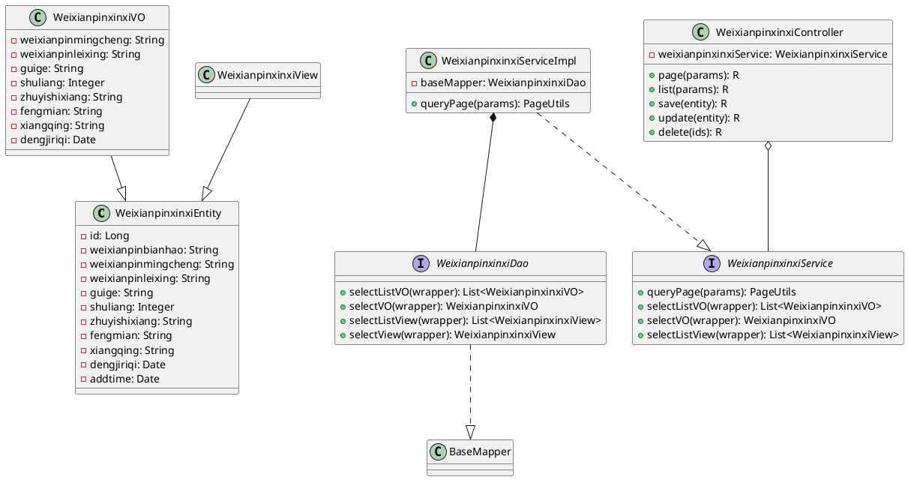

# 危险品信息管理模块详细设计

## 1. 模块概述

危险品信息管理模块是危险品物流管理系统中的核心模块之一，主要用于管理系统中所有的危险品信息，包括危险品的基本信息、类型分类、规格参数、存储数量、注意事项等。该模块为运输调度、车辆分配、应急处置等模块提供危险品数据支撑。

---

## 2. 类详细设计

### 2.1 实体类（Entity）

#### 2.1.1 WeixianpinxinxiEntity（危险品信息实体类）

**类说明**：危险品信息实体类，对应数据库中的 `weixianpinxinxi` 表，是本模块的核心业务实体。

**包路径**：`com.entity.WeixianpinxinxiEntity`

**类图表示**：

```
┌─────────────────────────────────────────────────────────────────┐
│                     WeixianpinxinxiEntity                        │
├─────────────────────────────────────────────────────────────────┤
│ - id: Long                           {主键}                      │
│ - weixianpinbianhao: String          {危险品编号}                 │
│ - weixianpinmingcheng: String        {危险品名称}                 │
│ - weixianpinleixing: String          {危险品类型}                 │
│ - guige: String                      {规格}                       │
│ - shuliang: Integer                  {数量}                       │
│ - zhuyishixiang: String              {注意事项}                   │
│ - fengmian: String                   {封面图片路径}               │
│ - xiangqing: String                  {详情描述}                   │
│ - dengjiriqi: Date                   {登记日期}                   │
│ - addtime: Date                      {创建时间}                   │
├─────────────────────────────────────────────────────────────────┤
│ + WeixianpinxinxiEntity()                                     │
│ + WeixianpinxinxiEntity(T t)                                   │
│ + getId(): Long                                                │
│ + setId(id: Long): void                                        │
│ + getWeixianpinbianhao(): String                               │
│ + setWeixianpinbianhao(weixianpinbianhao: String): void        │
│ + getWeixianpinmingcheng(): String                             │
│ + setWeixianpinmingcheng(weixianpinmingcheng: String): void    │
│ + getWeixianpinleixing(): String                               │
│ + setWeixianpinleixing(weixianpinleixing: String): void       │
│ + getGuige(): String                                           │
│ + setGuige(guige: String): void                                │
│ + getShuliang(): Integer                                       │
│ + setShuliang(shuliang: Integer): void                         │
│ + getZhuyishixiang(): String                                   │
│ + setZhuyishixiang(zhuyishixiang: String): void               │
│ + getFengmian(): String                                        │
│ + setFengmian(fengmian: String): void                          │
│ + getXiangqing(): String                                       │
│ + setXiangqing(xiangqing: String): void                        │
│ + getDengjiriqi(): Date                                        │
│ + setDengjiriqi(dengjiriqi: Date): void                        │
│ + getAddtime(): Date                                            │
│ + setAddtime(addtime: Date): void                              │
└─────────────────────────────────────────────────────────────────┘
```

**属性详细说明**：

| 属性名 | 数据类型 | 约束 | 说明 |
|--------|----------|------|------|
| id | Long | 主键、自增 | 危险品记录的唯一标识 |
| weixianpinbianhao | String | 非空、唯一 | 危险品的唯一编号，如 WB00001 |
| weixianpinmingcheng | String | 非空 | 危险品的名称，如"液化石油气" |
| weixianpinleixing | String | 非空 | 危险品类型，如"易燃气体"、"腐蚀性物质" |
| guige | String | - | 危险品的规格，如"50吨"、"30立方米" |
| shuliang | Integer | - | 危险品的数量 |
| zhuyishixiang | String | - | 运输和存储的注意事项 |
| fengmian | String | - | 危险品的封面图片路径 |
| xiangqing | String | - | 危险品的详细描述信息 |
| dengjiriqi | Date | - | 危险品信息登记日期 |
| addtime | Date | - | 记录创建时间，系统自动填充 |

**关键方法说明**：
- `WeixianpinxinxiEntity()`：无参构造函数
- `WeixianpinxinxiEntity(T t)`：泛型构造函数，用于对象属性拷贝
- 各属性的 getter/setter 方法用于访问和修改实体属性

---

### 2.2 值对象类（VO）

#### 2.2.1 WeixianpinxinxiVO（危险品信息值对象）

**类说明**：手机端接口返回实体辅助类，主要用于移动端接口返回，去除不必要的字段，减小数据传输量。

**包路径**：`com.entity.vo.WeixianpinxinxiVO`

**类图表示**：

```
┌─────────────────────────────────────────────────────────────────┐
│                      WeixianpinxinxiVO                          │
├─────────────────────────────────────────────────────────────────┤
│ - serialVersionUID: long           {序列化版本号}                │
│ - weixianpinmingcheng: String      {危险品名称}                 │
│ - weixianpinleixing: String        {危险品类型}                 │
│ - guige: String                    {规格}                       │
│ - shuliang: Integer                {数量}                       │
│ - zhuyishixiang: String            {注意事项}                   │
│ - fengmian: String                 {封面}                       │
│ - xiangqing: String                {详情}                       │
│ - dengjiriqi: Date                 {登记日期}                   │
├─────────────────────────────────────────────────────────────────┤
│ + WeixianpinxinxiVO()                                            │
│ + getWeixianpinmingcheng(): String                               │
│ + setWeixianpinmingcheng(weixianpinmingcheng: String): void     │
│ + getWeixianpinleixing(): String                                 │
│ + setWeixianpinleixing(weixianpinleixing: String): void         │
│ + getGuige(): String                                             │
│ + setGuige(guige: String): void                                  │
│ + getShuliang(): Integer                                         │
│ + setShuliang(shuliang: Integer): void                           │
│ + getZhuyishixiang(): String                                     │
│ + setZhuyishixiang(zhuyishixiang: String): void                 │
│ + getFengmian(): String                                          │
│ + setFengmian(fengmian: String): void                            │
│ + getXiangqing(): String                                         │
│ + setXiangqing(xiangqing: String): void                          │
│ + getDengjiriqi(): Date                                          │
│ + setDengjiriqi(dengjiriqi: Date): void                          │
└─────────────────────────────────────────────────────────────────┘
```

**与实体类区别**：
- VO 类不包含 `id`、`addtime` 等系统字段
- VO 类专门针对移动端返回数据进行优化
- 只保留业务相关的核心字段

---

### 2.3 视图类（View）

#### 2.3.1 WeixianpinxinxiView（危险品信息视图类）

**类说明**：后端返回视图实体辅助类，通常用于后端关联查询或多表联查场景。

**包路径**：`com.entity.view.WeixianpinxinxiView`

**类图表示**：

```
┌─────────────────────────────────────────────────────────────────┐
│                      WeixianpinxinxiView                        │
├─────────────────────────────────────────────────────────────────┤
│ - serialVersionUID: long           {序列化版本号}                │
├─────────────────────────────────────────────────────────────────┤
│ + WeixianpinxinxiView()                                         │
│ + WeixianpinxinxiView(WeixianpinxinxiEntity): 构造器            │
└─────────────────────────────────────────────────────────────────┘
                                    ▲
                                    │ extends
                                    │
┌─────────────────────────────────────────────────────────────────┐
│                      WeixianpinxinxiEntity                      │
└─────────────────────────────────────────────────────────────────┘
```

**说明**：
- View 类继承自 Entity 类
- 主要用于复杂查询场景，可以添加关联表的字段
- 包含 BeanUtils 属性拷贝功能

---

### 2.4 数据访问层（DAO）

#### 2.4.1 WeixianpinxinxiDao 接口

**类说明**：危险品信息数据访问接口，继承 MyBatis-Plus 的 BaseMapper，提供基础的 CRUD 操作。

**包路径**：`com.dao.WeixianpinxinxiDao`

**类图表示**：

```
┌─────────────────────────────────────────────────────────────────┐
│                    <<interface>>                                 │
│                   WeixianpinxinxiDao                            │
├─────────────────────────────────────────────────────────────────┤
│ + selectListVO(wrapper: Wrapper): List<WeixianpinxinxiVO>       │
│ + selectVO(wrapper: Wrapper): WeixianpinxinxiVO                 │
│ + selectListView(wrapper: Wrapper): List<WeixianpinxinxiView>   │
│ + selectListView(page, wrapper): List<WeixianpinxinxiView>     │
│ + selectView(wrapper: Wrapper): WeixianpinxinxiView             │
└─────────────────────────────────────────────────────────────────┘
           △
           │ extends
┌─────────────────────────────────────────────────────────────────┐
│                 BaseMapper<WeixianpinxinxiEntity>               │
│  (MyBatis-Plus 提供的基础Mapper，包含selectList、insert等方法)   │
└─────────────────────────────────────────────────────────────────┘
```

**方法说明**：
| 方法名 | 返回类型 | 说明 |
|--------|----------|------|
| selectListVO | List<WeixianpinxinxiVO> | 查询并返回VO列表 |
| selectVO | WeixianpinxinxiVO | 查询单个VO对象 |
| selectListView | List<WeixianpinxinxiView> | 查询并返回视图列表 |
| selectListView(page, wrapper) | List<WeixianpinxinxiView> | 分页查询视图列表 |
| selectView | WeixianpinxinxiView | 查询单个视图对象 |

---

### 2.5 业务逻辑层（Service）

#### 2.5.1 WeixianpinxinxiService 接口

**类说明**：危险品信息业务逻辑接口，定义业务操作方法。

**包路径**：`com.service.WeixianpinxinxiService`

**类图表示**：

```
┌─────────────────────────────────────────────────────────────────┐
│                    <<interface>>                                 │
│                  WeixianpinxinxiService                         │
├─────────────────────────────────────────────────────────────────┤
│ + queryPage(params: Map<String, Object>): PageUtils             │
│ + queryPage(params: Map, wrapper: Wrapper): PageUtils           │
│ + selectListVO(wrapper: Wrapper): List<WeixianpinxinxiVO>       │
│ + selectVO(wrapper: Wrapper): WeixianpinxinxiVO                 │
│ + selectListView(wrapper: Wrapper): List<WeixianpinxinxiView>   │
│ + selectView(wrapper: Wrapper): WeixianpinxinxiView             │
└─────────────────────────────────────────────────────────────────┘
           △
           │ implements
┌─────────────────────────────────────────────────────────────────┐
│                 IService<WeixianpinxinxiEntity>                 │
└─────────────────────────────────────────────────────────────────┘
```

#### 2.5.2 WeixianpinxinxiServiceImpl 实现类

**类说明**：危险品信息业务逻辑实现类，实现 Service 接口定义的方法。

**包路径**：`com.service.impl.WeixianpinxinxiServiceImpl`

**类图表示**：

```
┌─────────────────────────────────────────────────────────────────┐
│                  WeixianpinxinxiServiceImpl                     │
├─────────────────────────────────────────────────────────────────┤
│ - baseMapper: WeixianpinxinxiDao                                 │
├─────────────────────────────────────────────────────────────────┤
│ + queryPage(params: Map<String, Object>): PageUtils             │
│ + queryPage(params: Map, wrapper: Wrapper): PageUtils            │
│ + selectListVO(wrapper: Wrapper): List<WeixianpinxinxiVO>       │
│ + selectVO(wrapper: Wrapper): WeixianpinxinxiVO                 │
│ + selectListView(wrapper: Wrapper): List<WeixianpinxinxiView>   │
│ + selectView(wrapper: Wrapper): WeixianpinxinxiView             │
└─────────────────────────────────────────────────────────────────┘
           △
           │ extends
┌─────────────────────────────────────────────────────────────────┐
│          ServiceImpl<WeixianpinxinxiDao,                         │
│                  WeixianpinxinxiEntity>                         │
└─────────────────────────────────────────────────────────────────┘
```

**方法实现说明**：

| 方法 | 实现说明 |
|------|----------|
| queryPage(params) | 分页查询所有危险品信息 |
| queryPage(params, wrapper) | 根据条件分页查询危险品信息 |
| selectListVO | 查询危险品VO列表 |
| selectVO | 查询单个危险品VO |
| selectListView | 查询危险品视图列表 |
| selectView | 查询单个危险品视图 |

---

### 2.6 控制层（Controller）

#### 2.6.1 WeixianpinxinxiController

**类说明**：危险品信息管理控制层，处理前端请求，提供 RESTful API 接口。

**包路径**：`com.controller.WeixianpinxinxiController`

**类图表示**：

```
┌─────────────────────────────────────────────────────────────────┐
│                  WeixianpinxinxiController                      │
├─────────────────────────────────────────────────────────────────┤
│ - weixianpinxinxiService: WeixianpinxinxiService                │
├─────────────────────────────────────────────────────────────────┤
│ + page(params, entity, request): R           {后端列表}          │
│ + list(params, entity, request): R            {前端列表}          │
│ + lists(entity): R                            {列表查询}          │
│ + query(entity): R                            {条件查询}         │
│ + info(id): R                                 {后端详情}         │
│ + detail(id): R                               {前端详情}         │
│ + save(entity, request): R                    {后端保存}         │
│ + add(entity, request): R                     {前端保存}         │
│ + update(entity, request): R                  {修改更新}          │
│ + delete(ids): R                              {批量删除}         │
│ + remindCount(...): R                         {提醒接口}         │
└─────────────────────────────────────────────────────────────────┘
```

**接口说明**：

| 接口路径 | 方法 | 说明 | 权限 |
|----------|------|------|------|
| /weixianpinxinxi/page | POST | 后端分页列表查询 | 需登录 |
| /weixianpinxinxi/list | POST | 前端列表查询 | 公开 |
| /weixianpinxinxi/lists | POST | 列表查询 | - |
| /weixianpinxinxi/query | POST | 条件查询单条 | - |
| /weixianpinxinxi/info/{id} | GET | 后端详情查询 | 需登录 |
| /weixianpinxinxi/detail/{id} | GET | 前端详情查询 | 公开 |
| /weixianpinxinxi/save | POST | 后端保存 | 需登录 |
| /weixianpinxinxi/add | POST | 前端保存 | 需登录 |
| /weixianpinxinxi/update | POST | 修改更新 | 需登录 |
| /weixianpinxinxi/delete | POST | 批量删除 | 需登录 |
| /weixianpinxinxi/remind/{columnName}/{type} | POST | 提醒接口 | 需登录 |

---

## 3. 类之间关系图

```
┌─────────────────────────────────────────────────────────────────────────────┐
│                              类关系图                                        │
└─────────────────────────────────────────────────────────────────────────────┘

    ┌─────────────────────┐
    │  WeixianpinxinxiVO  │◄────── 值对象类（移动端返回）
    └─────────────────────┘
              △
              │ copy
              │
    ┌─────────────────────┐
    │ WeixianpinxinxiView │◄────── 视图类（复杂查询返回）
    └─────────────────────┘
              △
              │ extends
              │
    ┌─────────────────────────┐
    │ WeixianpinxinxiEntity   │◄────── 实体类（核心业务对象）
    └─────────────────────────┘
              △
              │ @TableName
              │
    ┌─────────────────────────┐
    │   weixianpinxinxi表     │◄────── 数据库表
    └─────────────────────────┘
              △
              │ ORM映射
              │
    ┌─────────────────────────┐
    │  WeixianpinxinxiDao     │◄────── 数据访问层接口
    └─────────────────────────┘
              △
              │ 实现
              │
    ┌─────────────────────────────┐
    │ WeixianpinxinxiService     │◄────── 业务逻辑层接口
    └─────────────────────────────┘
              △
              │ 实现
              │
    ┌─────────────────────────────────┐
    │ WeixianpinxinxiServiceImpl      │◄────── 业务逻辑层实现
    └─────────────────────────────────┘
              │
              │ 依赖注入
              ▼
    ┌─────────────────────────────────┐
    │ WeixianpinxinxiController       │◄────── 控制层（提供API）
    └─────────────────────────────────┘
              │
              │ HTTP请求
              ▼
    ┌─────────────────────────────────┐
    │          前端页面                 │
    └─────────────────────────────────┘
```

---

## 4. 数据库详细设计

### 4.1 数据表结构

#### weixianpinxinxi（危险品信息表）

| 字段名 | 数据类型 | 长度 | 允许空 | 主键 | 唯一 | 默认值 | 说明 |
|--------|----------|------|--------|------|------|--------|------|
| id | BIGINT | 20 | 否 | ✓ | - | - | 主键，自增 |
| addtime | TIMESTAMP | - | 否 | - | - | CURRENT_TIMESTAMP | 创建时间 |
| weixianpinbianhao | VARCHAR | 200 | 否 | - | ✓ | - | 危险品编号 |
| weixianpinmingcheng | VARCHAR | 200 | 否 | - | - | - | 危险品名称 |
| weixianpinleixing | VARCHAR | 200 | 是 | - | - | - | 危险品类型 |
| guige | VARCHAR | 200 | 是 | - | - | - | 规格 |
| shuliang | INT | 11 | 是 | - | - | - | 数量 |
| zhuyishixiang | LONGTEXT | - | 是 | - | - | - | 注意事项 |
| fengmian | VARCHAR | 200 | 是 | - | - | - | 封面图片路径 |
| xiangqing | LONGTEXT | - | 是 | - | - | - | 详情描述 |
| dengjiriqi | DATE | - | 是 | - | - | - | 登记日期 |

### 4.2 表结构图

```
┌─────────────────────────────────────────────────────────────────────┐
│                      weixianpinxinxi                                │
├─────────────────────────────────────────────────────────────────────┤
│ PK │ id               │ BIGINT(20)     │ NOT NULL | AUTO_INCREMENT │
├────┼──────────────────┼────────────────┼───────────┼─────────────────┤
│    │ addtime          │ TIMESTAMP      │ NOT NULL  │ DEFAULT NOW()   │
├────┼──────────────────┼────────────────┼───────────┼─────────────────┤
│ UK │ weixianpinbianhao│ VARCHAR(200)   │ NOT NULL  │                 │
├────┼──────────────────┼────────────────┼───────────┼─────────────────┤
│    │ weixianpinmingcheng│ VARCHAR(200) │ NOT NULL  │                 │
├────┼──────────────────┼────────────────┼───────────┼─────────────────┤
│    │ weixianpinleixing │ VARCHAR(200)   │ NULL      │                 │
├────┼──────────────────┼────────────────┼───────────┼─────────────────┤
│    │ guige             │ VARCHAR(200)   │ NULL      │                 │
├────┼──────────────────┼────────────────┼───────────┼─────────────────┤
│    │ shuliang          │ INT(11)        │ NULL      │                 │
├────┼──────────────────┼────────────────┼───────────┼─────────────────┤
│    │ zhuyishixiang     │ LONGTEXT       │ NULL      │                 │
├────┼──────────────────┼────────────────┼───────────┼─────────────────┤
│    │ fengmian          │ VARCHAR(200)   │ NULL      │                 │
├────┼──────────────────┼────────────────┼───────────┼─────────────────┤
│    │ xiangqing         │ LONGTEXT       │ NULL      │                 │
├────┼──────────────────┼────────────────┼───────────┼─────────────────┤
│    │ dengjiriqi        │ DATE           │ NULL      │                 │
└─────────────────────────────────────────────────────────────────────┘
```

### 4.3 索引设计

| 索引名 | 索引类型 | 字段 | 唯一 | 说明 |
|--------|----------|------|------|------|
| PRIMARY | 主键索引 | id | ✓ | 主键索引 |
| weixianpinbianhao | 唯一索引 | weixianpinbianhao | ✓ | 确保危险品编号唯一 |

### 4.4 ER图（实体关系图）

```
┌─────────────────────┐          ┌─────────────────────┐
│   危险品信息表        │          │     用户表           │
│  weixianpinxinxi    │          │      users          │
├─────────────────────┤          ├─────────────────────┤
│ PK id               │          │ PK id               │
│ UK weixianpinbianhao│          │    username         │
│    weixianpinmingcheng│        │    password         │
│    weixianpinleixing │         │    role             │
│    guige             │          │    addtime          │
│    shuliang          │          └─────────────────────┘
│    zhuyishixiang     │                   △
│    fengmian          │                   │管理
│    xiangqing         │                   │
│    dengjiriqi        │                   │
└─────────────────────┘                   │
          │                               │
          │ 1:N                          │
          ▼                               │
┌─────────────────────┐                   │
│    运输车次表        │                   │
│   yunshucheci       │                   │
├─────────────────────┤                   │
│ PK id               │                   │
│    yunshucheci      │                   │
│ FK weixianpinbianhao│───────────────────┘
│    weixianpinmingcheng│
│    shuliang          │
│    ...               │
└─────────────────────┘
```

---

## 5. 业务处理流程

### 5.1 危险品信息查询流程

```
┌──────────┐     ┌──────────────┐     ┌──────────────┐     ┌──────────────┐
│  前端请求  │────►│ Controller   │────►│   Service    │────►│     Dao      │
└──────────┘     └──────────────┘     └──────────────┘     └──────────────┘
                                                                    │
                                                                    ▼
                                                             ┌──────────────┐
                                                             │   MySQL     │
                                                             │   Database  │
                                                             └──────────────┘
                                                                    │
                                                                    ▼
┌──────────┐     ┌──────────────┐     ┌──────────────┐     ┌──────────────┐
│  返回数据 │◄────│    R.ok()    │◄────│  PageUtils   │◄────│   查询结果   │
└──────────┘     └──────────────┘     └──────────────┘     └──────────────┘
```

### 5.2 危险品信息新增/修改流程

```
┌──────────┐     ┌──────────────┐     ┌──────────────┐     ┌──────────────┐
│  提交数据  │────►│   数据校验    │────►│   保存/更新   │────►│   持久化     │
└──────────┘     └──────────────┘     └──────────────┘     └──────────────┘
                                                                    │
                                                                    ▼
                                                             ┌──────────────┐
                                                             │   MySQL     │
                                                             │   Database  │
                                                             └──────────────┘
                                                                    │
                                                                    ▼
┌──────────┐     ┌──────────────┐     ┌──────────────┐     ┌──────────────┐
│  返回结果 │◄────│   事务提交    │◄────│   执行成功    │◄────│  影响行数>0  │
└──────────┘     └──────────────┘     └──────────────┘     └──────────────┘
```

---

## 6. 功能说明

### 6.1 主要功能

| 功能 | 说明 |
|------|------|
| 危险品列表查询 | 分页展示所有危险品信息，支持按名称、类型等条件筛选 |
| 危险品详情查看 | 查看危险品的详细信息，包括规格、注意事项等 |
| 危险品新增 | 添加新的危险品信息到系统 |
| 危险品修改 | 编辑已有危险品的信息 |
| 危险品删除 | 批量删除危险品记录 |
| 危险品编号唯一性校验 | 确保危险品编号在系统中唯一 |

### 6.2 危险品类型分类

| 类型编号 | 类型名称 | 说明 |
|----------|----------|------|
| 1 | 易燃气体 | 如液化石油气、天然气等 |
| 2 | 易燃液体 | 如乙醇、苯等 |
| 3 | 易燃固体 | 如硫磺、赤磷等 |
| 4 | 氧化剂 | 如硝酸铵、高锰酸钾等 |
| 5 | 剧毒化学品 | 如氰化钠、砒霜等 |
| 6 | 腐蚀性物质 | 如浓硫酸、盐酸等 |
| 7 | 爆炸品 | 如TNT炸药、雷管等 |
| 8 | 放射性物质 | 如铀、钴-60等 |
| 9 | 感染性物质 | 如医疗废物、病毒样本等 |

---

## 7. 安全性设计

### 7.1 权限控制

| 接口 | 权限要求 |
|------|----------|
| 查询列表/详情 | 所有用户（公开） |
| 新增/修改/删除 | 管理员 |

### 7.2 数据校验

| 字段 | 校验规则 |
|------|----------|
| weixianpinbianhao | 非空、唯一、长度≤200 |
| weixianpinmingcheng | 非空、长度≤200 |
| shuliang | 整数、≥0 |

---

## 8. 附录：类图绘制说明

### 8.1 UML类图符号说明

| 符号 | 说明 |
|------|------|
| `+` | public 访问权限 |
| `-` | private 访问权限 |
| `#` | protected 访问权限 |
| `<<interface>>` | 接口标识 |
| `△` | 继承/实现关系 |
| `─►` | 依赖/关联关系 |
| `─▼` | 被依赖/被关联 |

### 8.2 类图绘制工具推荐

1. **StarUML** - 专业的UML建模工具
2. **PlantUML** - 文本描述的UML绘图工具
3. **draw.io** - 在线绘图工具，支持UML
4. **Visio** - Microsoft Visio
5. **ProcessOn** - 在线协作绘图平台

### 8.3 PlantUML代码示例

以下是本模块类图的PlantUML代码：



---

*文档版本：1.0*
*创建日期：2024年*
*作者：危险品物流管理系统开发团队*
