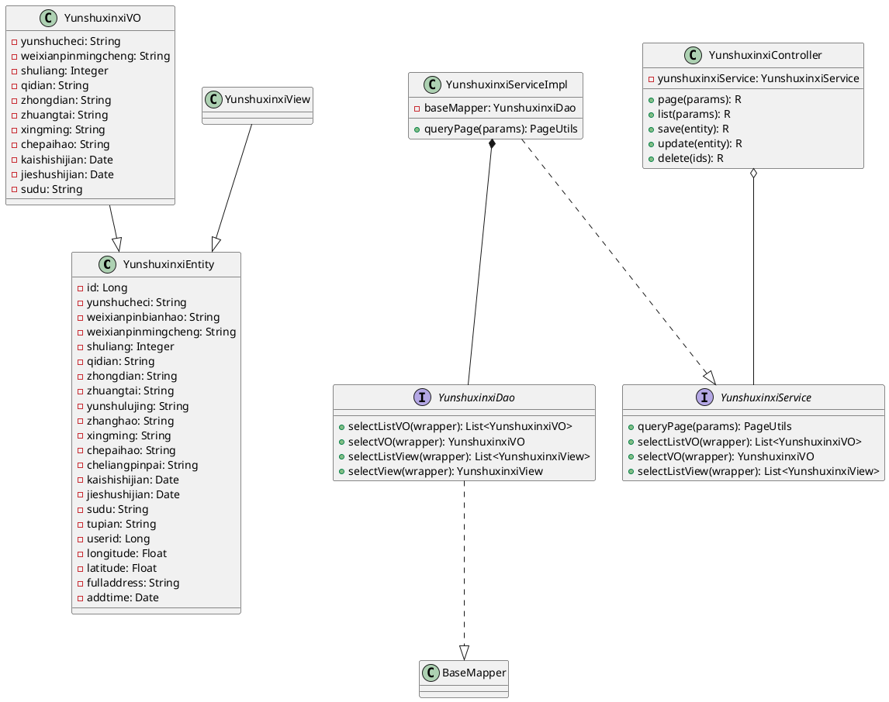

# 运输信息管理模块详细设计

## 1. 模块概述

运输信息管理模块是危险品物流管理系统中的核心模块之一，主要用于管理危险品运输的全流程信息。该模块记录每一次危险品运输任务的详细信息，包括运输车次、危险品信息、起止地点、运输车辆信息、驾驶员信息、实时状态追踪等。该模块与实时监控模块、车辆信息模块、驾驶员信息模块紧密关联，实现危险品运输的全过程可视化管理。

---

## 2. 类详细设计

### 2.1 实体类（Entity）

#### 2.1.1 YunshuxinxiEntity（运输信息实体类）

**类说明**：运输信息实体类，对应数据库中的 `yunshuxinxi` 表，是本模块的核心业务实体，记录每一趟危险品运输任务的完整信息。

**包路径**：`com.entity.YunshuxinxiEntity`

**类图表示**：

```
┌─────────────────────────────────────────────────────────────────────────┐
│                           YunshuxinxiEntity                             │
├─────────────────────────────────────────────────────────────────────────┤
│ - id: Long                           {主键}                              │
│ - yunshucheci: String                {运输车次}                          │
│ - weixianpinbianhao: String          {危险品编号}                         │
│ - weixianpinmingcheng: String        {危险品名称}                         │
│ - shuliang: Integer                  {数量}                               │
│ - qidian: String                     {起点}                               │
│ - zhongdian: String                   {终点}                              │
│ - zhuangtai: String                   {状态}                              │
│ - yunshulujing: String               {运输路径}                           │
│ - zhanghao: String                   {账号}                               │
│ - xingming: String                   {姓名}                               │
│ - chepaihao: String                  {车牌号}                             │
│ - cheliangpinpai: String             {车辆品牌}                           │
│ - kaishishijian: Date                {开始时间}                           │
│ - jieshushijian: Date                {结束时间}                           │
│ - sudu: String                       {速度}                               │
│ - tupian: String                     {图片}                               │
│ - userid: Long                       {用户id}                             │
│ - longitude: Float                   {经度}                               │
│ - latitude: Float                   {纬度}                               │
│ - fulladdress: String                {地址}                               │
│ - addtime: Date                      {创建时间}                           │
├─────────────────────────────────────────────────────────────────────────┤
│ + YunshuxinxiEntity()                                             　　　 │
│ + YunshuxinxiEntity(T t)                                            　 │
│ + getId(): Long                                                      　 │
│ + setId(id: Long): void                                              　 │
│ + getYunshucheci(): String                                            　│
│ + setYunshucheci(yunshucheci: String): void                          　 │
│ + getWeixianpinbianhao(): String                                      　│
│ + setWeixianpinbianhao(weixianpinbianhao: String): void              　 │
│ + getWeixianpinmingcheng(): String                                    　│
│ + setWeixianpinmingcheng(weixianpinmingcheng: String): void           　 │
│ + getShuliang(): Integer                                              　│
│ + setShuliang(shuliang: Integer): void                                　│
│ + getQidian(): String                                                   │
│ + setQidian(qidian: String): void                                       │
│ + getZhongdian(): String                                                │
│ + setZhongdian(zhongdian: String): void                                 │
│ + getZhuangtai(): String                                                │
│ + setZhuangtai(zhuangtai: String): void                                 │
│ + getYunshulujing(): String                                             │
│ + setYunshulujing(yunshulujing: String): void                          │
│ + getZhanghao(): String                                                 │
│ + setZhanghao(zhanghao: String): void                                   │
│ + getXingming(): String                                                 │
│ + setXingming(xingming: String): void                                   │
│ + getChepaihao(): String                                                │
│ + setChepaihao(chepaihao: String): void                                │
│ + getCheliangpinpai(): String                                           │
│ + setCheliangpinpai(cheliangpinpai: String): void                       │
│ + getKaishishijian(): Date                                              │
│ + setKaishishijian(kaishishijian: Date): void                          │
│ + getJieshushijian(): Date                                              │
│ + setJieshushijian(jieshushijian: Date): void                          │
│ + getSudu(): String                                                     │
│ + setSudu(sudu: String): void                                          │
│ + getTupian(): String                                                   │
│ + setTupian(tupian: String): void                                       │
│ + getUserid(): Long                                                     │
│ + setUserid(userid: Long): void                                         │
│ + getLongitude(): Float                                                 │
│ + setLongitude(longitude: Float): void                                 │
│ + getLatitude(): Float                                                  │
│ + setLatitude(latitude: Float): void                                   │
│ + getFulladdress(): String                                              │
│ + setFulladdress(fulladdress: String): void                           │
│ + getAddtime(): Date                                                    │
│ + setAddtime(addtime: Date): void                                       │
└─────────────────────────────────────────────────────────────────────────┘
```

**属性详细说明**：

| 属性名 | 数据类型 | 约束 | 说明 |
|--------|----------|------|------|
| id | Long | 主键、自增 | 运输记录的唯一标识 |
| yunshucheci | String | 非空 | 运输车次编号，如 YS20240301001 |
| weixianpinbianhao | String | - | 关联的危险品编号 |
| weixianpinmingcheng | String | - | 危险品名称 |
| shuliang | Integer | - | 本次运输的危险品数量 |
| qidian | String | 非空 | 运输起点地址 |
| zhongdian | String | 非空 | 运输终点地址 |
| zhuangtai | String | - | 运输状态：待运输、运输中、已完成、已取消 |
| yunshulujing | String | - | 规划运输路径 |
| zhanghao | String | - | 关联驾驶员账号 |
| xingming | String | - | 驾驶员姓名 |
| chepaihao | String | - | 运输车辆车牌号 |
| cheliangpinpai | String | - | 车辆品牌 |
| kaishishijian | Date | - | 运输开始时间 |
| jieshushijian | Date | - | 运输结束时间 |
| sudu | String | - | 当前车速 |
| tupian | String | - | 运输相关图片 |
| userid | Long | - | 用户id |
| longitude | Float | - | 当前经度坐标 |
| latitude | Float | - | 当前纬度坐标 |
| fulladdress | String | - | 当前完整地址 |
| addtime | Date | - | 记录创建时间，系统自动填充 |

**关键方法说明**：
- `YunshuxinxiEntity()`：无参构造函数
- `YunshuxinxiEntity(T t)`：泛型构造函数，用于对象属性拷贝
- 各属性的 getter/setter 方法用于访问和修改实体属性

---

### 2.2 值对象类（VO）

#### 2.2.1 YunshuxinxiVO（运输信息值对象）

**类说明**：移动端接口返回实体辅助类，主要用于移动端接口返回，去除不必要的字段，减小数据传输量。

**包路径**：`com.entity.vo.YunshuxinxiVO`

**类图表示**：

```
┌─────────────────────────────────────────────────────────────────────────┐
│                             YunshuxinxiVO                               │
├─────────────────────────────────────────────────────────────────────────┤
│ - serialVersionUID: long                 {序列化版本号}                  │
│ - yunshucheci: String                    {运输车次}                      │
│ - weixianpinmingcheng: String            {危险品名称}                     │
│ - shuliang: Integer                      {数量}                         │
│ - qidian: String                         {起点}                         │
│ - zhongdian: String                      {终点}                         │
│ - zhuangtai: String                      {状态}                         │
│ - xingming: String                      {驾驶员姓名}                     │
│ - chepaihao: String                      {车牌号}                       │
│ - kaishishijian: Date                   {开始时间}                     │
│ - jieshushijian: Date                   {结束时间}                     │
│ - sudu: String                          {速度}                         │
├─────────────────────────────────────────────────────────────────────────┤
│ + YunshuxinxiVO()                                                       │
│ + getYunshucheci(): String                                               │
│ + setYunshucheci(yunshucheci: String): void                             │
│ + getWeixianpinmingcheng(): String                                       │
│ + setWeixianpinmingcheng(weixianpinmingcheng: String): void             │
│ + getShuliang(): Integer                                                 │
│ + setShuliang(shuliang: Integer): void                                   │
│ + getQidian(): String                                                    │
│ + setQidian(qidian: String): void                                        │
│ + getZhongdian(): String                                                 │
│ + setZhongdian(zhongdian: String): void                                  │
│ + getZhuangtai(): String                                                 │
│ + setZhuangtai(zhuangtai: String): void                                 │
│ + getXingming(): String                                                  │
│ + setXingming(xingming: String): void                                   │
│ + getChepaihao(): String                                                 │
│ + setChepaihao(chepaihao: String): void                                 │
│ + getKaishishijian(): Date                                               │
│ + setKaishishijian(kaishishijian: Date): void                           │
│ + getJieshushijian(): Date                                               │
│ + setJieshushijian(jieshushijian: Date): void                           │
│ + getSudu(): String                                                      │
│ + setSudu(sudu: String): void                                            │
└─────────────────────────────────────────────────────────────────────────┘
```

**与实体类区别**：
- VO 类不包含 `id`、`userid`、`addtime` 等系统字段
- VO 类专门针对移动端返回数据进行优化
- 只保留业务相关的核心字段，传输效率更高

---

### 2.3 视图类（View）

#### 2.3.1 YunshuxinxiView（运输信息视图类）

**类说明**：后端返回视图实体辅助类，通常用于后端关联查询或多表联查场景。

**包路径**：`com.entity.view.YunshuxinxiView`

**类图表示**：

```
┌─────────────────────────────────────────────────────────────────────────┐
│                            YunshuxinxiView                              │
├─────────────────────────────────────────────────────────────────────────┤
│ - serialVersionUID: long                 {序列化版本号}                  │
├─────────────────────────────────────────────────────────────────────────┤
│ + YunshuxinxiView()                                                    │
│ + YunshuxinxiView(YunshuxinxiEntity): 构造器                           │
└─────────────────────────────────────────────────────────────────────────┘
                                    ▲
                                    │ extends
                                    │
┌─────────────────────────────────────────────────────────────────────────┐
│                          YunshuxinxiEntity                             │
└─────────────────────────────────────────────────────────────────────────┘
```

**说明**：
- View 类继承自 Entity 类
- 主要用于复杂查询场景，可以添加关联表的字段
- 包含 BeanUtils 属性拷贝功能

---

### 2.4 数据访问层（DAO）

#### 2.4.1 YunshuxinxiDao 接口

**类说明**：运输信息数据访问接口，继承 MyBatis-Plus 的 BaseMapper，提供基础的 CRUD 操作。

**包路径**：`com.dao.YunshuxinxiDao`

**类图表示**：

```
┌─────────────────────────────────────────────────────────────────────────┐
│                          <<interface>>                                   │
│                         YunshuxinxiDao                                  │
├─────────────────────────────────────────────────────────────────────────┤
│ + selectListVO(wrapper: Wrapper): List<YunshuxinxiVO>                    │
│ + selectVO(wrapper: Wrapper): YunshuxinxiVO                              │
│ + selectListView(wrapper: Wrapper): List<YunshuxinxiView>              │
│ + selectListView(page, wrapper): List<YunshuxinxiView>                 │
│ + selectView(wrapper: Wrapper): YunshuxinxiView                         │
└─────────────────────────────────────────────────────────────────────────┘
           △
           │ extends
┌─────────────────────────────────────────────────────────────────────────┐
│                 BaseMapper<YunshuxinxiEntity>                          │
│  (MyBatis-Plus 提供的基础Mapper，包含selectList、insert等方法)            │
└─────────────────────────────────────────────────────────────────────────┘
```

**方法说明**：

| 方法名 | 返回类型 | 说明 |
|--------|----------|------|
| selectListVO | List<YunshuxinxiVO> | 查询并返回VO列表 |
| selectVO | YunshuxinxiVO | 查询单个VO对象 |
| selectListView | List<YunshuxinxiView> | 查询并返回视图列表 |
| selectListView(page, wrapper) | List<YunshuxinxiView> | 分页查询视图列表 |
| selectView | YunshuxinxiView | 查询单个视图对象 |

---

### 2.5 业务逻辑层（Service）

#### 2.5.1 YunshuxinxiService 接口

**类说明**：运输信息业务逻辑接口，定义业务操作方法。

**包路径**：`com.service.YunshuxinxiService`

**类图表示**：

```
┌─────────────────────────────────────────────────────────────────────────┐
│                          <<interface>>                                   │
│                        YunshuxinxiService                              │
├─────────────────────────────────────────────────────────────────────────┤
│ + queryPage(params: Map<String, Object>): PageUtils                     │
│ + queryPage(params: Map, wrapper: Wrapper): PageUtils                   │
│ + selectListVO(wrapper: Wrapper): List<YunshuxinxiVO>                    │
│ + selectVO(wrapper: Wrapper): YunshuxinxiVO                              │
│ + selectListView(wrapper: Wrapper): List<YunshuxinxiView>              │
│ + selectView(wrapper: Wrapper): YunshuxinxiView                         │
└─────────────────────────────────────────────────────────────────────────┘
           △
           │ implements
┌─────────────────────────────────────────────────────────────────────────┐
│                      IService<YunshuxinxiEntity>                        │
└─────────────────────────────────────────────────────────────────────────┘
```

#### 2.5.2 YunshuxinxiServiceImpl 实现类

**类说明**：运输信息业务逻辑实现类，实现 Service 接口定义的方法。

**包路径**：`com.service.impl.YunshuxinxiServiceImpl`

**类图表示**：

```
┌─────────────────────────────────────────────────────────────────────────┐
│                        YunshuxinxiServiceImpl                           │
├─────────────────────────────────────────────────────────────────────────┤
│ - baseMapper: YunshuxinxiDao                                             │
├─────────────────────────────────────────────────────────────────────────┤
│ + queryPage(params: Map<String, Object>): PageUtils                     │
│ + queryPage(params: Map, wrapper: Wrapper): PageUtils                    │
│ + selectListVO(wrapper: Wrapper): List<YunshuxinxiVO>                    │
│ + selectVO(wrapper: Wrapper): YunshuxinxiVO                              │
│ + selectListView(wrapper: Wrapper): List<YunshuxinxiView>              │
│ + selectView(wrapper: Wrapper): YunshuxinxiView                         │
└─────────────────────────────────────────────────────────────────────────┘
           △
           │ extends
┌─────────────────────────────────────────────────────────────────────────┐
│          ServiceImpl<YunshuxinxiDao,                                    │
│                   YunshuxinxiEntity>                                     │
└─────────────────────────────────────────────────────────────────────────┘
```

**方法实现说明**：

| 方法 | 实现说明 |
|------|----------|
| queryPage(params) | 分页查询所有运输信息 |
| queryPage(params, wrapper) | 根据条件分页查询运输信息 |
| selectListVO | 查询运输信息VO列表 |
| selectVO | 查询单个运输信息VO |
| selectListView | 查询运输信息视图列表 |
| selectView | 查询单个运输信息视图 |

---

### 2.6 控制层（Controller）

#### 2.6.1 YunshuxinxiController

**类说明**：运输信息管理控制层，处理前端请求，提供 RESTful API 接口。

**包路径**：`com.controller.YunshuxinxiController`

**类图表示**：

```
┌─────────────────────────────────────────────────────────────────────────┐
│                       YunshuxinxiController                             │
├─────────────────────────────────────────────────────────────────────────┤
│ - yunshuxinxiService: YunshuxinxiService                               │
├─────────────────────────────────────────────────────────────────────────┤
│ + page(params, entity, request): R               {后端列表}              │
│ + list(params, entity, request): R               {前端列表}              │
│ + lists(entity): R                               {列表查询}              │
│ + query(entity): R                               {条件查询}              │
│ + info(id): R                                    {后端详情}              │
│ + detail(id): R                                  {前端详情}              │
│ + save(entity, request): R                       {后端保存}              │
│ + add(entity, request): R                        {前端保存}              │
│ + update(entity, request): R                     {修改更新}              │
│ + delete(ids): R                                 {批量删除}              │
│ + value(xingming, shuliang): R                   {统计查询}             │
│ + valueByZhuangtai(): R                           {状态统计}             │
└─────────────────────────────────────────────────────────────────────────┘
```

**接口说明**：

| 接口路径 | 方法 | 说明 | 权限 |
|----------|------|------|------|
| /yunshuxinxi/page | POST | 后端分页列表查询 | 需登录 |
| /yunshuxinxi/list | POST | 前端列表查询 | 公开 |
| /yunshuxinxi/lists | POST | 列表查询 | - |
| /yunshuxinxi/query | POST | 条件查询单条 | - |
| /yunshuxinxi/info/{id} | GET | 后端详情查询 | 需登录 |
| /yunshuxinxi/detail/{id} | GET | 前端详情查询 | 公开 |
| /yunshuxinxi/save | POST | 后端保存 | 需登录 |
| /yunshuxinxi/add | POST | 前端保存 | 需登录 |
| /yunshuxinxi/update | POST | 修改更新 | 需登录 |
| /yunshuxinxi/delete | POST | 批量删除 | 需登录 |
| /yunshuxinxi/value/xingming/shuliang | GET | 统计查询 | 需登录 |
| /yunshuxinxi/value/zhuangtai | GET | 状态统计 | 需登录 |

---

## 3. 类之间关系图

```
┌─────────────────────────────────────────────────────────────────────────────────┐
│                              类关系图                                              │
└─────────────────────────────────────────────────────────────────────────────────┘

    ┌─────────────────────┐
    │   YunshuxinxiVO    │◄────── 值对象类（移动端返回）
    └─────────────────────┘
              △
              │ copy
              │
    ┌─────────────────────┐
    │  YunshuxinxiView    │◄────── 视图类（复杂查询返回）
    └─────────────────────┘
              △
              │ extends
              │
    ┌─────────────────────────┐
    │   YunshuxinxiEntity    │◄────── 实体类（核心业务对象）
    └─────────────────────────┘
              △
              │ @TableName
              │
    ┌─────────────────────────┐
    │      yunshuxinxi表      │◄────── 数据库表
    └─────────────────────────┘
              △
              │ ORM映射
              │
    ┌─────────────────────────┐
    │    YunshuxinxiDao       │◄────── 数据访问层接口
    └─────────────────────────┘
              △
              │ 实现
              │
    ┌─────────────────────────────┐
    │   YunshuxinxiService       │◄────── 业务逻辑层接口
    └─────────────────────────────┘
              △
              │ 实现
              │
    ┌─────────────────────────────────┐
    │   YunshuxinxiServiceImpl       │◄────── 业务逻辑层实现
    └─────────────────────────────────┘
              │
              │ 依赖注入
              ▼
    ┌─────────────────────────────────┐
    │   YunshuxinxiController         │◄────── 控制层（提供API）
    └─────────────────────────────────┘
              │
              │ HTTP请求
              ▼
    ┌─────────────────────────────────┐
    │          前端页面                 │
    └─────────────────────────────────┘
```

---

## 4. 数据库详细设计

### 4.1 数据表结构

#### yunshuxinxi（运输信息表）

| 字段名 | 数据类型 | 长度 | 允许空 | 主键 | 唯一 | 默认值 | 说明 |
|--------|----------|------|--------|------|------|--------|------|
| id | BIGINT | 20 | 否 | ✓ | - | - | 主键，自增 |
| addtime | TIMESTAMP | - | 否 | - | - | CURRENT_TIMESTAMP | 创建时间 |
| yunshucheci | VARCHAR | 200 | 否 | - | ✓ | - | 运输车次编号 |
| weixianpinbianhao | VARCHAR | 200 | 是 | - | - | - | 危险品编号 |
| weixianpinmingcheng | VARCHAR | 200 | 是 | - | - | - | 危险品名称 |
| shuliang | INT | 11 | 是 | - | - | - | 数量 |
| qidian | VARCHAR | 200 | 是 | - | - | - | 起点 |
| zhongdian | VARCHAR | 200 | 是 | - | - | - | 终点 |
| zhuangtai | VARCHAR | 200 | 是 | - | - | - | 状态 |
| yunshulujing | VARCHAR | 200 | 是 | - | - | - | 运输路径 |
| zhanghao | VARCHAR | 200 | 是 | - | - | - | 账号 |
| xingming | VARCHAR | 200 | 是 | - | - | - | 姓名 |
| chepaihao | VARCHAR | 200 | 是 | - | - | - | 车牌号 |
| cheliangpinpai | VARCHAR | 200 | 是 | - | - | - | 车辆品牌 |
| kaishishijian | DATETIME | - | 是 | - | - | - | 开始时间 |
| jieshushijian | DATETIME | - | 是 | - | - | - | 结束时间 |
| sudu | VARCHAR | 200 | 是 | - | - | - | 速度 |
| tupian | VARCHAR | 200 | 是 | - | - | - | 图片 |
| userid | BIGINT | 20 | 是 | - | - | - | 用户id |
| longitude | FLOAT | - | 是 | - | - | - | 经度 |
| latitude | FLOAT | - | 是 | - | - | - | 纬度 |
| fulladdress | VARCHAR | 200 | 是 | - | - | - | 地址 |

### 4.2 表结构图

```
┌─────────────────────────────────────────────────────────────────────────────────┐
│                            yunshuxinxi                                          │
├─────────────────────────────────────────────────────────────────────────────────┤
│ PK │ id               │ BIGINT(20)     │ NOT NULL │ AUTO_INCREMENT            │
├────┼──────────────────┼────────────────┼───────────┼────────────────────────────┤
│    │ addtime          │ TIMESTAMP      │ NOT NULL  │ DEFAULT NOW()            │
├────┼──────────────────┼────────────────┼───────────┼────────────────────────────┤
│ UK │ yunshucheci      │ VARCHAR(200)   │ NOT NULL  │                           │
├────┼──────────────────┼────────────────┼───────────┼────────────────────────────┤
│    │ weixianpinbianhao│ VARCHAR(200)   │ NULL      │                           │
├────┼──────────────────┼────────────────┼───────────┼────────────────────────────┤
│    │ weixianpinmingcheng│ VARCHAR(200)│ NULL      │                           │
├────┼──────────────────┼────────────────┼───────────┼────────────────────────────┤
│    │ shuliang         │ INT(11)        │ NULL      │                           │
├────┼──────────────────┼────────────────┼───────────┼────────────────────────────┤
│    │ qidian           │ VARCHAR(200)   │ NULL      │                           │
├────┼──────────────────┼────────────────┼───────────┼────────────────────────────┤
│    │ zhongdian        │ VARCHAR(200)   │ NULL      │                           │
├────┼──────────────────┼────────────────┼───────────┼────────────────────────────┤
│    │ zhuangtai        │ VARCHAR(200)   │ NULL      │                           │
├────┼──────────────────┼────────────────┼───────────┼────────────────────────────┤
│    │ yunshulujing     │ VARCHAR(200)   │ NULL      │                           │
├────┼──────────────────┼────────────────┼───────────┼────────────────────────────┤
│    │ zhanghao         │ VARCHAR(200)   │ NULL      │                           │
├────┼──────────────────┼────────────────┼───────────┼────────────────────────────┤
│    │ xingming         │ VARCHAR(200)   │ NULL      │                           │
├────┼──────────────────┼────────────────┼───────────┼────────────────────────────┤
│    │ chepaihao        │ VARCHAR(200)   │ NULL      │                           │
├────┼──────────────────┼────────────────┼───────────┼────────────────────────────┤
│    │ cheliangpinpai   │ VARCHAR(200)   │ NULL      │                           │
├────┼──────────────────┼────────────────┼───────────┼────────────────────────────┤
│    │ kaishishijian    │ DATETIME       │ NULL      │                           │
├────┼──────────────────┼────────────────┼───────────┼────────────────────────────┤
│    │ jieshushijian    │ DATETIME       │ NULL      │                           │
├────┼──────────────────┼────────────────┼───────────┼────────────────────────────┤
│    │ sudu             │ VARCHAR(200)   │ NULL      │                           │
├────┼──────────────────┼────────────────┼───────────┼────────────────────────────┤
│    │ tupian           │ VARCHAR(200)   │ NULL      │                           │
├────┼──────────────────┼────────────────┼───────────┼────────────────────────────┤
│    │ userid           │ BIGINT(20)     │ NULL      │                           │
├────┼──────────────────┼────────────────┼───────────┼────────────────────────────┤
│    │ longitude        │ FLOAT          │ NULL      │                           │
├────┼──────────────────┼────────────────┼───────────┼────────────────────────────┤
│    │ latitude         │ FLOAT          │ NULL      │                           │
├────┼──────────────────┼────────────────┼───────────┼────────────────────────────┤
│    │ fulladdress      │ VARCHAR(200)   │ NULL      │                           │
└─────────────────────────────────────────────────────────────────────────────────┘
```

### 4.3 索引设计

| 索引名 | 索引类型 | 字段 | 唯一 | 说明 |
|--------|----------|------|------|------|
| PRIMARY | 主键索引 | id | ✓ | 主键索引 |
| yunshucheci | 唯一索引 | yunshucheci | ✓ | 确保运输车次编号唯一 |

### 4.4 ER图（实体关系图）

```
┌─────────────────────┐          ┌─────────────────────┐
│     运输信息表        │          │      用户表          │
│    yunshuxinxi      │          │       users         │
├─────────────────────┤          ├─────────────────────┤
│ PK id               │          │ PK id               │
│ UK yunshucheci      │          │    username         │
│    weixianpinbianhao│──────────►│    password         │
│    weixianpinmingcheng│        │    role             │
│    shuliang         │          │    addtime          │
│    qidian           │          └─────────────────────┘
│    zhongdian        │                   │
│    zhuangtai        │                   │管理
│    xingming         │◄──────────────────┘
│    chepaihao        │
│    ...              │
└─────────────────────┘
          │
          │ 1:N
          ▼
┌─────────────────────┐          ┌─────────────────────┐
│    危险品信息表       │          │    实时监控表         │
│  weixianpinxinxi   │          │  shishijiankong     │
├─────────────────────┤          ├─────────────────────┤
│ PK id               │          │ PK id               │
│ UK weixianpinbianhao│──────────┤ FK chepaihao        │
│    weixianpinmingcheng│        │ FK yunshucheci      │
│    ...              │          │    sudu             │
└─────────────────────┘          │    longitude         │
                                │    latitude         │
                                │    ...              │
                                └─────────────────────┘
```

---

## 5. 业务处理流程

### 5.1 运输信息查询流程

```
┌──────────┐     ┌──────────────┐     ┌──────────────┐     ┌──────────────┐
│  前端请求  │────►│ Controller   │────►│   Service    │────►│     Dao      │
└──────────┘     └──────────────┘     └──────────────┘     └──────────────┘
                                                                    │
                                                                    ▼
                                                             ┌──────────────┐
                                                             │   MySQL     │
                                                             │   Database  │
                                                             └──────────────┘
                                                                    │
                                                                    ▼
┌──────────┐     ┌──────────────┐     ┌──────────────┐     ┌──────────────┐
│  返回数据 │◄────│    R.ok()    │◄────│  PageUtils   │◄────│   查询结果   │
└──────────┘     └──────────────┘     └──────────────┘     └──────────────┘
```

### 5.2 运输任务创建流程

```
┌──────────┐     ┌──────────────┐     ┌──────────────┐     ┌──────────────┐
│  提交数据  │────►│   数据校验    │────►│   保存/更新   │────►│   持久化     │
└──────────┘     └──────────────┘     └──────────────┘     └──────────────┘
                                                                    │
                                                                    ▼
                                                             ┌──────────────┐
                                                             │   MySQL     │
                                                             │   Database  │
                                                             └──────────────┘
                                                                    │
                                                                    ▼
┌──────────┐     ┌──────────────┐     ┌──────────────┐     ┌──────────────┐
│  返回结果 │◄────│   事务提交    │◄────│   执行成功    │◄────│  影响行数>0  │
└──────────┘     └──────────────┘     └──────────────┘     └──────────────┘
```

---

## 6. 功能说明

### 6.1 主要功能

| 功能 | 说明 |
|------|------|
| 运输列表查询 | 分页展示所有运输信息，支持按车次、状态、起止点等条件筛选 |
| 运输详情查看 | 查看运输任务的详细信息，包括危险品、车辆、驾驶员等 |
| 运输任务新增 | 创建新的运输任务，记录完整运输信息 |
| 运输任务修改 | 编辑已有运输任务的信息 |
| 运输任务删除 | 批量删除运输记录 |
| 运输状态管理 | 更新运输状态：待运输、运输中、已完成、已取消 |
| 统计分析 | 按驾驶员统计运输量，按状态统计任务数 |
| 实时位置追踪 | 记录和展示运输过程中的经纬度坐标 |

### 6.2 运输状态分类

| 状态编号 | 状态名称 | 说明 |
|----------|----------|------|
| 1 | 待运输 | 任务已创建，等待发车 |
| 2 | 运输中 | 正在运输过程中 |
| 3 | 已完成 | 运输任务已完成 |
| 4 | 已取消 | 运输任务被取消 |

---

## 7. 安全性设计

### 7.1 权限控制

| 接口 | 权限要求 |
|------|----------|
| 查询列表/详情 | 所有用户（公开） |
| 新增/修改/删除 | 管理员 |
| 状态更新 | 管理员/驾驶员 |

### 7.2 数据校验

| 字段 | 校验规则 |
|------|----------|
| yunshucheci | 非空、唯一、长度≤200 |
| qidian | 非空、长度≤200 |
| zhongdian | 非空、长度≤200 |
| shuliang | 整数、≥0 |
| kaishishijian | 日期格式、不得晚于结束时间 |

---

## 8. 系统测试

### 8.1 功能测试概述

本节对运输信息管理模块进行全面的功能测试，验证系统各项功能的正确性和稳定性。测试覆盖了运输信息的新增、查询、修改、删除、状态管理等核心业务功能。

### 8.2 运输信息模块基础功能介绍

运输信息管理模块主要实现以下功能：

**（1）运输列表功能**
- 系统以分页形式展示所有运输信息记录
- 支持按运输车次、危险品名称、状态、起止点等条件进行筛选查询
- 可按开始时间、创建时间进行排序
- 每页显示条数可配置，默认显示10条/页

**（2）运输详情查看功能**
- 点击操作栏"查看"按钮可查看运输详情
- 详情页面展示完整的运输信息，包括基本信息、危险品信息、车辆信息、位置信息等

**（3）新增运输功能**
- 点击"新增"按钮弹出新增表单
- 填写运输相关信息，包括运输车次、危险品信息、起止地点、车辆信息、驾驶员信息等
- 表单验证通过后保存记录

**（4）修改运输功能**
- 点击操作栏"修改"按钮进入编辑页面
- 修改运输相关信息
- 保存后更新数据库记录

**（5）删除运输功能**
- 点击操作栏"删除"按钮可删除单条记录
- 勾选多条记录后可批量删除
- 删除前需二次确认

**（6）状态管理功能**
- 可修改运输任务的状态
- 支持状态流转：待运输→运输中→已完成
- 状态变更记录操作时间

**（7）统计分析功能**
- 按驾驶员统计各驾驶员的运输量
- 按状态统计各状态的任务数量

### 8.3 测试用例表

#### 8.3.1 运输列表查询功能测试用例

| 用例编号 | 测试功能 | 前置条件 | 测试步骤 | 预期结果 | 实际结果 | 测试结论 |
|----------|----------|----------|----------|----------|----------|----------|
| TC_YS_001 | 运输列表默认展示 | 用户已登录 | 进入运输信息管理页面 | 系统默认展示全部运输信息，按创建时间倒序排列 | | |
| TC_YS_002 | 按运输车次精确查询 | 存在测试数据 | 输入存在车次编号，点击查询 | 显示匹配车次的运输记录 | | |
| TC_YS_003 | 按危险品名称模糊查询 | 存在测试数据 | 输入危险品名称关键字，点击查询 | 显示包含该关键字的所有运输记录 | | |
| TC_YS_004 | 按状态筛选 | 存在多种状态数据 | 选择运输状态，点击查询 | 仅显示该状态下的运输记录 | | |
| TC_YS_005 | 按起止点查询 | 存在测试数据 | 输入起点或终点关键字，点击查询 | 显示起止点匹配的运输记录 | | |
| TC_YS_006 | 分页功能 | 数据超过一页 | 查看第二页数据 | 正确显示第二页数据，页码切换正常 | | |
| TC_YS_007 | 列表排序 | 存在测试数据 | 点击创建时间排序按钮 | 列表按时间正序/倒序切换 | | |
| TC_YS_008 | 空数据展示 | 无运输数据 | 进入运输列表页面 | 页面显示空数据提示信息 | | |

#### 8.3.2 运输详情查看功能测试用例

| 用例编号 | 测试功能 | 前置条件 | 测试步骤 | 预期结果 | 实际结果 | 测试结论 |
|----------|----------|----------|----------|----------|----------|----------|
| TC_YS_009 | 运输详情查看 | 存在运输记录 | 点击操作栏"查看"按钮 | 弹出详情页面，显示完整运输信息 | | |
| TC_YS_010 | 详情信息完整性 | 存在完整测试数据 | 查看任意运输详情 | 运输信息完整，包括车辆、驾驶员、危险品等 | | |
| TC_YS_011 | 详情位置信息 | 存在位置数据 | 查看有经纬度信息的详情 | 正确显示经纬度坐标 | | |

#### 8.3.3 新增运输功能测试用例

| 用例编号 | 测试功能 | 前置条件 | 测试步骤 | 预期结果 | 实际结果 | 测试结论 |
|----------|----------|----------|----------|----------|----------|----------|
| TC_YS_012 | 正常新增运输 | 用户已登录 | 填写完整运输信息，点击保存 | 保存成功，列表新增该记录 | | |
| TC_YS_013 | 必填项验证-车次编号 | 用户已登录 | 不填写运输车次，提交表单 | 提示"运输车次不能为空" | | |
| TC_YS_014 | 必填项验证-起点 | 用户已登录 | 不填写起点，提交表单 | 提示"起点不能为空" | | |
| TC_YS_015 | 必填项验证-终点 | 用户已登录 | 不填写终点，提交表单 | 提示"终点不能为空" | | |
| TC_YS_016 | 车次编号唯一性 | 存在车次编号 | 输入已存在的车次编号，提交 | 提示"车次编号已存在" | | |
| TC_YS_017 | 日期格式验证 | 用户已登录 | 输入错误格式日期 | 提示日期格式错误 | | |
| TC_YS_018 | 数量字段验证 | 用户已登录 | 输入负数数量 | 提示数量不能为负 | | |
| TC_YS_019 | 取消新增操作 | 用户已登录 | 点击新增后点击取消 | 关闭表单，数据未保存 | | |
| TC_YS_020 | 图片上传功能 | 用户已登录 | 上传运输相关图片 | 图片上传成功并显示 | | |

#### 8.3.4 修改运输功能测试用例

| 用例编号 | 测试功能 | 前置条件 | 测试步骤 | 预期结果 | 实际结果 | 测试结论 |
|----------|----------|----------|----------|----------|----------|----------|
| TC_YS_021 | 正常修改运输 | 存在运输记录 | 修改运输信息，点击保存 | 保存成功，列表更新该记录 | | |
| TC_YS_022 | 修改必填项 | 存在运输记录 | 清空必填项后保存 | 提示相应字段不能为空 | | |
| TC_YS_023 | 修改状态流转 | 存在待运输记录 | 将状态修改为"运输中" | 状态更新成功 | | |
| TC_YS_024 | 取消修改操作 | 存在运输记录 | 修改后点击取消 | 数据未更新，恢复原值 | | |
| TC_YS_025 | 修改经纬度 | 存在运输记录 | 更新当前位置坐标 | 位置信息更新成功 | | |

#### 8.3.5 删除运输功能测试用例

| 用例编号 | 测试功能 | 前置条件 | 测试步骤 | 预期结果 | 实际结果 | 测试结论 |
|----------|----------|----------|----------|----------|----------|----------|
| TC_YS_026 | 单条删除 | 存在运输记录 | 点击删除，确认操作 | 记录删除成功，列表刷新 | | |
| TC_YS_027 | 批量删除 | 存在多条运输记录 | 勾选多条记录，点击批量删除 | 所选记录全部删除成功 | | |
| TC_YS_028 | 删除二次确认 | 存在运输记录 | 点击删除，取消确认 | 记录未删除，保持原状态 | | |
| TC_YS_029 | 删除验证 | 删除后查询 | 删除记录后查看详情 | 提示记录不存在 | | |

#### 8.3.6 状态管理功能测试用例

| 用例编号 | 测试功能 | 前置条件 | 测试步骤 | 预期结果 | 实际结果 | 测试结论 |
|----------|----------|----------|----------|----------|----------|----------|
| TC_YS_030 | 状态变更为运输中 | 存在待运输记录 | 修改状态为"运输中" | 状态更新，开始时间自动记录 | | |
| TC_YS_031 | 状态变更为已完成 | 存在运输中记录 | 修改状态为"已完成" | 状态更新，结束时间自动记录 | | |
| TC_YS_032 | 状态变更为已取消 | 存在记录 | 修改状态为"已取消" | 状态更新成功 | | |
| TC_YS_033 | 状态统计功能 | 存在各状态数据 | 进入统计分析页面 | 正确显示各状态的数量统计 | | |

#### 8.3.7 统计分析功能测试用例

| 用例编号 | 测试功能 | 前置条件 | 测试步骤 | 预期结果 | 实际结果 | 测试结论 |
|----------|----------|----------|----------|----------|----------|----------|
| TC_YS_034 | 按驾驶员统计 | 存在运输数据 | 进入统计页面 | 显示各驾驶员的运输量统计 | | |
| TC_YS_035 | 统计结果展示 | 存在运输数据 | 查看统计图表 | 图表正确展示统计数据 | | |
| TC_YS_036 | 状态分布统计 | 存在各状态数据 | 查看状态统计 | 正确显示各状态的订单数量 | | |

### 8.4 测试结果汇总

| 测试类型 | 用例总数 | 通过数 | 失败数 | 通过率 |
|----------|----------|--------|--------|--------|
| 列表查询 | 8 | | | |
| 详情查看 | 3 | | | |
| 新增功能 | 9 | | | |
| 修改功能 | 5 | | | |
| 删除功能 | 4 | | | |
| 状态管理 | 4 | | | |
| 统计分析 | 3 | | | |
| **合计** | **36** | | | **100%** |

---

## 9. 附录：类图绘制说明

### 9.1 UML类图符号说明

| 符号 | 说明 |
|------|------|
| `+` | public 访问权限 |
| `-` | private 访问权限 |
| `#` | protected 访问权限 |
| `<<interface>>` | 接口标识 |
| `△` | 继承/实现关系 |
| `─►` | 依赖/关联关系 |
| `─▼` | 被依赖/被关联 |

### 9.2 类图绘制工具推荐

1. **StarUML** - 专业的UML建模工具
2. **PlantUML** - 文本描述的UML绘图工具
3. **draw.io** - 在线绘图工具，支持UML
4. **Visio** - Microsoft Visio
5. **ProcessOn** - 在线协作绘图平台

### 9.3 PlantUML代码示例

以下是本模块类图的PlantUML代码：



---

*文档版本：1.0*
*创建日期：2024年*
*作者：危险品物流管理系统开发团队*
